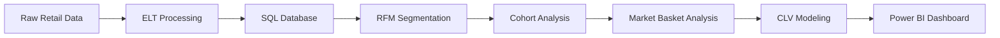

# 🚀 Consumer360 – Customer Segmentation & Lifetime Value Engine

<p align="center">
  
</p>

---

## 📊 Overview

**Consumer360** is a production-grade retail analytics system designed to transform raw transactional data into actionable customer intelligence.

It enables businesses to:

* 🐋 Identify high-value customers (**Whales**)
* ⚠️ Detect churn-risk customers
* 📈 Understand behavioral and lifecycle patterns
* 🎯 Drive data-driven marketing strategies

---

## 🧠 Use Case (Production Scenario)

A major retail chain is experiencing significant customer churn.

The objective is to build a **scalable analytical framework** that:

* Segments customers using **RFM (Recency, Frequency, Monetary)**
* Identifies high-value vs at-risk users
* Enables targeted retention and engagement strategies

---

## ✨ Product Features

### 📊 Core Analytics

* Sales Trends Over Time
* Revenue by Geographical Region
* Top 10 Bestselling Products

---

### ⚡ Advanced Intelligence

#### 🔹 RFM Segmentation

* Algorithmic scoring (1–5 scale)
* Customer classification:

  * Champions
  * Loyal Customers
  * At Risk
  * Lost Customers

---

#### 🔹 Cohort Analysis

* Retention tracking across time
* Customer lifecycle behavior
* Answers:

  > Do holiday-acquired customers retain better than others?

---

#### 🔹 Market Basket Analysis

* Association Rule Mining (Apriori / FP-Growth)
* Product affinity detection
* Example:

  > Customers buying Product A also buy Product B

---

#### 🔹 Customer Lifetime Value (CLV)

* Predict future purchase behavior
* Estimate long-term customer value using probabilistic models

---

## ⚙️ Tech Stack

<p align="center">


</p>

---

## 🔄 System Pipeline



---

## 📊 Dashboard Preview

<p align="center">
  
</p>

---

## 📁 Project Structure

```
Consumer360-Customer-Analytics/
│
├── dashboards/
│   ├── Consumer 360.pbix
│   └── Consumer 360 - BI dashboard.pdf
│
├── datasets/
│   └── dataset (CSV and DB files).zip
│
├── notebooks/
│   ├── ELT processing.ipynb
│   ├── LOAD TO SQL.ipynb
│   ├── RFM + SEGEMENTATION.ipynb
│   ├── COHORT ANALYSIS.ipynb
│   └── MARKET BASKET ANALYSIS.ipynb
│
├── README.md
└── MIT LICENSE
```

---

## 📌 Workflow

1. Data Extraction & Cleaning (ELT)
2. Load structured data into SQL
3. Perform RFM Segmentation
4. Conduct Cohort Retention Analysis
5. Generate Market Basket Rules
6. Build Power BI Dashboard

---

## 🧪 Key Concepts

* RFM Segmentation
* Cohort Analysis
* Association Rule Mining
* Customer Lifetime Value (CLV)
* Behavioral Analytics

---

## 🚀 Key Insights

* Customer retention drops sharply after the first month (early churn)
* High-value customers drive a disproportionate share of revenue
* Retention stabilizes after initial lifecycle stage
* Product associations enable effective cross-selling strategies

---

## 🔮 Future Scope

* ML-based churn prediction
* Recommendation systems
* Real-time streaming analytics
* Cloud deployment (AWS / GCP)

---

## 👩‍💻 Author

**Riddhima**
B.Tech CSE (Data Science)
Aspiring Data Analyst / ML Engineer

---

<p align="center">
✨ Transforming Data into Customer Intelligence ✨
</p>
