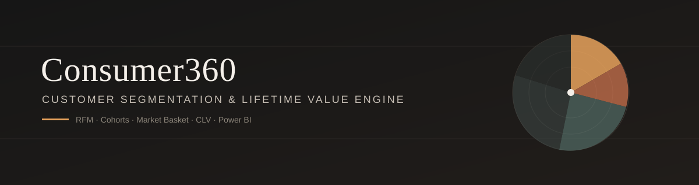
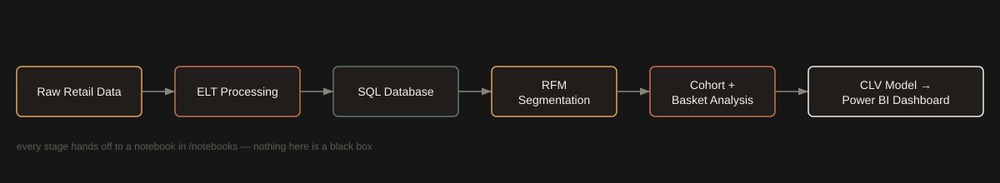

<br/>


## The problem

A retail chain can see that customers are leaving. What it can't see, from a transaction log alone, is *which* customers matter most, *when* they start to disengage, and *what* to do about it before they're gone. That gap — between raw point-of-sale data and an actual retention decision — is what this project closes.

## The approach

Consumer360 takes a transaction table through five analytical passes, each answering one question a retention or marketing team would actually ask:

| Pass | Question it answers |
|---|---|
| **RFM Segmentation** | Who are our best customers, and who's already slipping away? |
| **Cohort Analysis** | Does *when* someone was acquired predict how long they'll stay? |
| **Market Basket Analysis** | What do customers buy together, and what should we recommend next? |
| **CLV Modeling** | Which customers are worth the marketing spend to save? |
| **Power BI Dashboard** | How does a non-technical stakeholder explore all of this themselves? |

Each pass lives in its own notebook, in order, so nothing is a black box — you can open `notebooks/RFM + SEGEMENTATION.ipynb` and see exactly how a customer ends up labeled "Champion" vs. "At Risk."



## What the analysis actually shows

- **Churn isn't gradual — it's front-loaded.** Retention drops hardest in the first month after acquisition, then levels off. Whatever a retention strategy does, it has to happen early.
- **Value is concentrated, not evenly spread.** A small "Champions" segment accounts for a disproportionate share of revenue — the RFM model exists specifically to make that segment visible and actionable.
- **Purchases aren't independent events.** The market basket rules surface real product affinities, which is what turns "we should cross-sell" from a guess into a specific, testable recommendation.
- **Acquisition timing matters.** Cohort retention curves differ by acquisition period, which is useful for planning *when* to run acquisition campaigns, not just how.

## RFM segments, defined

| Segment | What it means |
|---|---|
| 🏆 Champions | Recent, frequent, high-spend — the core of the business |
| 💎 Loyal Customers | Reliable repeat buyers, not yet top-tier spenders |
| ⚠️ At Risk | Used to be regular, has gone quiet — the segment worth acting on first |
| ☠️ Lost | Long inactive, low historical value |

## Stack

`SQL` for storage and RFM scoring queries · `Python (Pandas, NumPy)` for ELT, cohort math, and Apriori/FP-Growth basket mining · `Power BI` for the stakeholder-facing dashboard.

## Repository layout

```
Consumer360-Customer-Analytics/
│
├── dashboards/
│   ├── Consumer 360.pbix
│   ├── Consumer 360 - BI dashboard.pdf
│   └── *.png                          (dashboard screenshots)
│
├── datasets/
│   └── dataset (CSV + DB files).zip
│
├── notebooks/
│   ├── ELT processing.ipynb
│   ├── LOAD TO SQL.ipynb
│   ├── RFM + SEGEMENTATION.ipynb
│   ├── COHORT ANALYSIS.ipynb
│   └── MARKET BASKET ANALYSIS.ipynb
│
├── assets/                            (README graphics)
├── README.md
└── LICENSE (MIT)
```

## Dashboard

<p align="center">
  
</p>
<p align="center">
  
</p>
<p align="center">
  
</p>

## Where this goes next

- Churn prediction as a proper supervised model, not just an RFM heuristic
- A recommendation layer built on top of the basket-analysis rules
- Streaming ingestion instead of batch ELT
- Cloud deployment (AWS / GCP) so the dashboard reflects live data

<br/>

<p align="center"><sub>MIT licensed · built as part of a portfolio of retail, finance, healthcare, and logistics analytics projects</sub></p>
