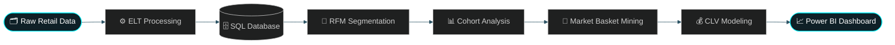

<div align="center">


<br/>


</div>


## 🎯 What This Is

A retail chain is bleeding customers and doesn't know why. **Consumer360** turns raw POS/transaction logs into a decision-ready customer intelligence layer — who's about to churn, who's secretly a whale, and what to sell them next — packaged end-to-end from raw CSV to a live Power BI dashboard.

<table align="center">
<tr>
<td align="center" width="25%">

### 🐋
**Whale Detection**
Surface the top-value customers driving disproportionate revenue

</td>
<td align="center" width="25%">

### ⚠️
**Churn Signals**
Flag at-risk and lapsed customers before they're gone

</td>
<td align="center" width="25%">

### 📈
**Lifecycle Insight**
Cohort retention curves across acquisition periods

</td>
<td align="center" width="25%">

### 🎯
**Growth Levers**
Product-affinity rules for cross-sell / bundling

</td>
</tr>
</table>


## 🔄 Pipeline


```mermaid
%%{init: {'theme':'dark', 'themeVariables': {'primaryColor':'#0F2027','primaryTextColor':'#00F7FF','primaryBorderColor':'#00F7FF','lineColor':'#2C5364','secondaryColor':'#150458','tertiaryColor':'#1a1a2e'}}}%%
flowchart LR
    A(["🗂️ Raw Retail Data"]) --> B["⚙️ ELT Processing"]
    B --> C[("🗄️ SQL Database")]
    C --> D["🎯 RFM Segmentation"]
    D --> E["📊 Cohort Analysis"]
    E --> F["🛒 Market Basket Mining"]
    F --> G["💰 CLV Modeling"]
    G --> H(["📈 Power BI Dashboard"])

    style A fill:#0F2027,stroke:#00F7FF,color:#fff
    style H fill:#0F2027,stroke:#00F7FF,color:#fff
```

## ⚡ Core Modules

<details open>
<summary><b>🔹 RFM Segmentation</b></summary>
<br/>

Algorithmic 1–5 scoring across **Recency, Frequency, Monetary** dimensions, mapped into actionable tiers:

| Tier | Meaning |
|---|---|
| 🏆 Champions | Bought recently, often, and big |
| 💎 Loyal Customers | Consistent repeat buyers |
| ⚠️ At Risk | Used to buy often, gone quiet |
| ☠️ Lost | Long inactive, low value |

</details>

<details>
<summary><b>🔹 Cohort Analysis</b></summary>
<br/>

Tracks retention by acquisition month to answer questions like:
> *Do holiday-acquired customers retain better than customers acquired in an average month?*

Outputs a retention heatmap across the customer lifecycle.

</details>

<details>
<summary><b>🔹 Market Basket Analysis</b></summary>
<br/>

Apriori / FP-Growth association-rule mining over transaction baskets to surface rules like:
> *Customers who buy Product A are significantly more likely to also buy Product B.*

Powers cross-sell and bundling recommendations.

</details>

<details>
<summary><b>🔹 Customer Lifetime Value (CLV)</b></summary>
<br/>

Probabilistic modeling to project forward purchase behavior and estimate long-term customer value — used to prioritize retention spend where it actually pays off.

</details>


## 📊 Dashboard

<div align="center">

<br/><br/>

<br/><br/>

</div>

## 🧪 Key Insights

- 📉 **Early churn is the biggest leak** — retention drops sharply within the first month post-acquisition
- 💰 **Revenue is concentrated** — a small slice of "Champion" customers drives a disproportionate share of total revenue
- 📈 **Retention stabilizes** after the initial lifecycle stage, meaning early intervention matters most
- 🛒 **Product affinities are actionable** — clear cross-sell rules emerge from basket analysis

## 📁 Project Structure

```
Consumer360-Customer-Analytics/
│
├── 📊 dashboards/
│   ├── Consumer 360.pbix
│   ├── Consumer 360 - BI dashboard.pdf
│   └── *.png
│
├── 🗃️ datasets/
│   └── dataset (CSV + DB files).zip
│
├── 📓 notebooks/
│   ├── ELT processing.ipynb
│   ├── LOAD TO SQL.ipynb
│   ├── RFM + SEGMENTATION.ipynb
│   ├── COHORT ANALYSIS.ipynb
│   └── MARKET BASKET ANALYSIS.ipynb
│
├── README.md
└── LICENSE (MIT)
```

## 🔮 Future Scope

- 🤖 ML-based churn prediction
- 🎯 Recommendation engine
- ⏱️ Real-time streaming analytics
- ☁️ Cloud deployment (AWS / GCP)


<div align="center">

### 🛠️ Built With


<br/><br/>


**⭐ If this project helped you, consider starring the repo!**

</div>
