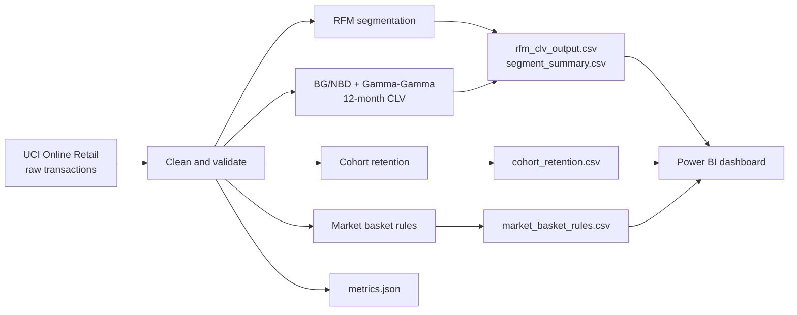

<br/>


# Consumer360

**Customer analytics on 12 months of e-commerce transactions, from raw data to a decision-ready Power BI dashboard.**

`clean` → `RFM segmentation` → `12-month CLV` → `cohort retention` → `market basket` → `Power BI`

[Results](#headline-results) · [Key findings](#key-findings) · [Methodology](#methodology) · [Playbook](#segment-playbook) · [Reproduce](#reproduce) · [Limitations](#limitations) · [FAQ](#faq)

> **In one paragraph:** Revenue at this retailer is extremely concentrated. **19% of customers (Champions) generate 63.4% of revenue**, and about **80% of new customers never return after their first month**. Consumer360 turns the transaction log into six actionable customer segments, a validated 12-month CLV ranking, cohort retention curves and cross-sell rules, so marketing effort can go where the money is.

---

## Table of contents

1. [Headline results](#headline-results)
2. [Key findings](#key-findings)
3. [Pipeline at a glance](#pipeline-at-a-glance)
4. [Dataset](#dataset)
5. [Data quality: what was fixed and why it matters](#data-quality-what-was-fixed-and-why-it-matters)
6. [Methodology](#methodology)
7. [Segment playbook](#segment-playbook)
8. [Dashboard](#dashboard)
9. [Outputs](#outputs)
10. [Repository layout](#repository-layout)
11. [Reproduce](#reproduce)
12. [Limitations](#limitations)
13. [Roadmap](#roadmap)
14. [FAQ](#faq)
15. [Tech stack](#tech-stack) · [Citation](#citation-and-acknowledgements) · [License](#license)

---

## Headline results

| Metric | Result |
|---|---|
| Customers analysed | **4,333** |
| Invoices / revenue (after cleaning) | **18,400** / **$8.49M** |
| Top 20% of customers → share of revenue | **73.9%** |
| Champions (19% of customers) → share of revenue | **63.4%** |
| One-time buyers | **34.7%** of customers |
| Month-1 retention (avg of 2011 cohorts) | **19.8%** (range 14.8%–23.5%) |
| Month-3 / Month-6 retention | **22.9%** / **25.0%** |
| CLV model: decile-level correlation, predicted vs actual (6-month holdout) | **0.994** |
| Basket rules found (support ≥ 1%, confidence ≥ 30%, lift ≥ 1.5) | **445** across 629 frequent products |

Every number above is written to [`outputs/metrics.json`](outputs/metrics.json) by the pipeline, so the README can be checked against the code.

---

## Key findings

1. **Revenue is highly concentrated.** The top 20% of customers drive 73.9% of revenue; the 822 Champions alone drive 63.4%. Losing a handful of large (often wholesale) accounts would move the top line far more than losing hundreds of small ones.
2. **Churn is front-loaded.** Roughly 80% of a new cohort does not order again in month 1. The highest-leverage moment for retention is the first 30 days, not the long tail.
3. **At Risk customers are worth more than their label suggests.** Historically they earn almost as much per head as Loyal customers (see the revenue index below) but have gone quiet. Win-back here should be prioritised ahead of broad reactivation of Hibernating customers.
4. **Hibernating customers are the largest group and the least valuable.** They are 30.9% of customers, 7.1% of revenue, with an average 12-month CLV of $418. Only low-cost reactivation is justified.
5. **Cross-sell rules are dominated by product variants.** The strongest rules link colour or design variants of one product family (e.g. Regency tea plate pink → green: lift 61, confidence 90%). Useful for merchandising, but not for true cross-category bundles until variants are grouped into families.
6. **The CLV model ranks customers well but should not be used as a revenue forecast.** It orders customers almost perfectly by decile (r = 0.994) yet under-predicts total volume by 11.8% on the holdout, which includes the Q4 holiday peak.

---

## Pipeline at a glance


```mermaid
flowchart LR
    A[UCI Online Retail<br/>raw transactions] --> B[Clean and validate]
    B --> C[RFM segmentation]
    B --> D[BG/NBD + Gamma-Gamma<br/>12-month CLV]
    B --> E[Cohort retention]
    B --> F[Market basket rules]
    C --> G[rfm_clv_output.csv<br/>segment_summary.csv]
    D --> G
    E --> H[cohort_retention.csv]
    F --> I[market_basket_rules.csv]
    G --> J[Power BI dashboard]
    H --> J
    I --> J
    B --> K[metrics.json]
```

The whole pipeline lives in one script, [`consumer360_pipeline.py`](consumer360_pipeline.py), and runs end to end with a single command (see [Reproduce](#reproduce)).

---

## Dataset

UCI *Online Retail*: transactions from a UK-based online gift-ware retailer, **1 Dec 2010 – 9 Dec 2011**. About 89% of line items are UK. Many customers are wholesalers, so a few accounts are very large, which is a major reason revenue concentration is so high.

---

## Data quality: what was fixed and why it matters

Raw transaction data is rarely analysis-ready. Each fix below was made because it would otherwise distort a specific result.

| Issue in raw data | Handling | Impact |
|---|---|---|
| 5,192 exact duplicate rows | Dropped | Removes double-counted revenue |
| 1,542 non-product lines (`POST`, `M`, `DOT`, `BANK CHARGES`, `C2`, `PADS`) | Dropped (keep 5-digit product codes only) | −$150K; stops postage and fees from appearing in basket rules |
| 2 fully cancelled orders (#581483, #541431) whose originals survived the cancellation filter | Dropped | −$246K; one customer was previously ranked #4 by CLV from a cancelled order |
| Product descriptions with trailing spaces / variants | One canonical description per `StockCode` | Prevents the same product appearing as two items |
| **Total** | **$8.91M → $8.49M (−4.7%)** | |

---

## Methodology

### 1. RFM segmentation

- **Recency** and **Monetary**: quintile scores; identical values always receive the same score.
- **Frequency**: fixed bins (1 / 2 / 3–4 / 5–8 / 9+ orders → F = 1 to 5), because 35% of customers bought once and quantile cuts cannot split ties fairly.
- Six non-overlapping segments, defined on R and F and evaluated top to bottom (first match wins):

| Segment | Rule | Customers | % of revenue | Revenue index* | Avg 12-mo CLV |
|---|---|---|---|---|---|
| 🏆 Champions | R ≥ 4 and F ≥ 4 | 822 (19.0%) | 63.4% | 3.34× | $6,506 |
| 💎 Loyal | R ≥ 3 and F ≥ 3 | 792 (18.3%) | 16.1% | 0.88× | $2,310 |
| 🌱 New / Promising | R ≥ 4, F ≤ 2 | 517 (11.9%) | 3.0% | 0.25× | $1,424 |
| 👀 Needs Attention | R = 3, F ≤ 2 | 478 (11.0%) | 2.9% | 0.26× | $938 |
| ⚠️ At Risk | R ≤ 2 and F ≥ 3 | 384 (8.9%) | 7.5% | 0.84× | $1,609 |
| 💤 Hibernating | R ≤ 2 and F ≤ 2 | 1,340 (30.9%) | 7.1% | 0.23× | $418 |

<sub>*Revenue index = share of revenue ÷ share of customers (1.00× is an average customer). It reflects historical spend, not forecast CLV.</sub>

**How the R × F grid maps to segments** (F = 4 means 5–8 orders, F = 5 means 9+ orders):

| | F = 1 | F = 2 | F = 3 | F = 4 | F = 5 |
|---|---|---|---|---|---|
| **R = 5** | New / Promising | New / Promising | Loyal | Champions | Champions |
| **R = 4** | New / Promising | New / Promising | Loyal | Champions | Champions |
| **R = 3** | Needs Attention | Needs Attention | Loyal | Loyal | Loyal |
| **R = 2** | Hibernating | Hibernating | At Risk | At Risk | At Risk |
| **R = 1** | Hibernating | Hibernating | At Risk | At Risk | At Risk |

Monetary (M) is scored and retained in the output for filtering, but it does not define segment membership.

### 2. Customer lifetime value

- **BG/NBD** (expected purchases) × **Gamma-Gamma** (expected order value) → expected revenue over the next 365 days.
- Validated on a holdout: fit on the first ~6 months, predict the last ~6 months.

| Validation metric | Value |
|---|---|
| Customers validated | 2,784 |
| Decile-level correlation (predicted vs actual purchases) | 0.994 |
| Customer-level MAE (model / naive own-rate / global mean) | 1.49 / 1.59 / 2.24 |
| Total purchases predicted vs actual | 5,997 vs 6,802 (−11.8%) |
| Frequency–order-value correlation (Gamma-Gamma assumption) | 0.11 |

**Read this as a ranking tool, not a revenue forecast.** The model orders customers very well, but under-predicts volume by ~12% because the holdout window contains the Q4 holiday peak. One year of data also gives no evidence of customer "death" (the BG/NBD dropout parameters converge to ~0), so probability-alive is not reported.

<details>
<summary><b>How to interpret the validation numbers</b></summary>

- **Decile-level r = 0.994** means that when customers are grouped into ten predicted-value buckets, average predicted and actual purchases move together almost perfectly. This supports using CLV to *prioritise* customers.
- **Customer-level MAE 1.49 vs 1.59 (naive own-rate)** means individual-level predictions beat a simple "repeat your own past rate" baseline by a modest margin (about 6%), and beat the global mean by about a third (1.49 vs 2.24). Individual customers stay hard to predict; the strength is in ranking and aggregation.
- **−11.8% total bias** is a level error, not a ranking error: the model was fit on the first half of the year and asked to predict a window containing the holiday peak. Recalibrating with a seasonality factor would be needed before using totals for budgeting.
- **Frequency–order-value correlation of 0.11** is low, so Gamma-Gamma's assumption that order value is independent of purchase frequency is reasonable for this data.

</details>

### 3. Cohort retention

- Cohort = month of first purchase; retention = share of the cohort ordering in month *n*.
- Two artefacts are excluded from averages:
  - **Dec-2010 cohort** (884 customers, ~3× the median cohort): left-censored, since it includes existing customers rather than new ones.
  - **Dec-2011 activity**: the month is incomplete (data ends 9 Dec).

| Finding | Evidence |
|---|---|
| Churn is front-loaded | ~80% of a new cohort does not return in month 1 |
| No further steady decay after month 1 | Retention is 19.8% at M1, 22.9% at M3, 25.0% at M6 |
| Acquisition timing has a modest effect | M1 retention spans 14.8%–23.5% across 2011 cohorts |

### 4. Market basket analysis

- Baskets = invoices (18,400); rules evaluated in **both directions**, with support measured over all invoices.
- Filters: support ≥ 1%, confidence ≥ 30%, lift ≥ 1.5.
- Strongest rules are **colour/design variants of the same product family** (e.g. Regency tea plate pink → green: lift 61, confidence 90%). Group variants into families before using rules for cross-sell.

---

## Segment playbook

| Segment | Objective | Action | Suggested KPI |
|---|---|---|---|
| Champions | Protect | Early access, loyalty perks, account management for the largest accounts; the top ~20% of customers drive ~74% of revenue | Champion retention rate; share of Champions moving to At Risk |
| Loyal | Upgrade | Upsell toward Champions using basket-rule bundles | Migration rate Loyal → Champions |
| New / Promising | Convert | Second-purchase campaign inside month 1 (where most churn happens) | Month-1 repurchase rate |
| Needs Attention | Nudge | Time-limited reminders before they slip to At Risk | Share reordering within 30 days |
| At Risk | Win back | Win-back offers, prioritised by 12-month CLV | CLV-weighted win-back rate |
| Hibernating | Reactivate cheaply | Low-cost reactivation only; avg CLV is $418 | Cost per reactivated customer vs CLV |

`outputs/rfm_clv_output.csv` contains segment and CLV per customer, so any of these lists can be pulled straight into a campaign tool.

---

## Dashboard

The Power BI report, a PDF export and screenshots live in [`dashboards/`](dashboards/).

<!-- Add a preview so visitors see the result without opening Power BI, e.g.:
<p align="center"></p>
-->

---

## Outputs

| File | Grain | Contents |
|---|---|---|
| `outputs/rfm_clv_output.csv` | One row per customer | R, F, M scores, segment, 12-month CLV |
| `outputs/segment_summary.csv` | One row per segment | Customer counts, revenue share, average CLV |
| `outputs/cohort_retention.csv` | Cohort × month | Retention by first-purchase month |
| `outputs/market_basket_rules.csv` | One row per rule | Antecedent, consequent, support, confidence, lift |
| `outputs/metrics.json` | Key → value | Every number quoted in this README |

---

## Repository layout

```
Consumer-360/
├── consumer360_pipeline.py        # reproducible clean → RFM → CLV → cohort → basket
├── notebooks/                     # exploratory versions of each step
├── outputs/
│   ├── rfm_clv_output.csv         # one row per customer: R, F, M, segment, 12-mo CLV
│   ├── segment_summary.csv
│   ├── cohort_retention.csv
│   ├── market_basket_rules.csv
│   └── metrics.json               # every number quoted in this README
├── dashboards/                    # .pbix, PDF export, screenshots
├── datasets/
├── assets/
├── README.md
└── LICENSE
```

---

## Reproduce

```bash
git clone https://github.com/<your-username>/Consumer-360.git
cd Consumer-360

pip install pandas numpy lifetimes
python consumer360_pipeline.py --db retailiq.db --out outputs/
```

Then check `outputs/metrics.json` against the [headline results](#headline-results). To explore step by step, open the notebooks in [`notebooks/`](notebooks/).

---

## Limitations

- **One year of data:** no multi-season view, and no independent test of seasonality.
- **Transactions only:** no marketing spend, margins, or channel data, so CLV is revenue-based, not profit-based.
- **Judgement-based cut-offs:** RFM segment boundaries are not validated against campaign response.
- **Wholesale skew:** a small number of very large accounts influence concentration figures and segment averages.
- **Level bias in CLV:** the model under-predicts total purchases by ~12% on the holdout, so use it to rank customers, not to set revenue targets.
- **No causal claims:** retention differences between cohorts are descriptive; nothing here shows that an acquisition month *causes* better retention.

---

## Roadmap

- [ ] Supervised churn model (time-based split, precision/recall/AUC)
- [ ] Basket rules on product families rather than individual SKUs
- [ ] Profit-based CLV once margin data is available
- [ ] Backtest on the longer UCI *Online Retail II* dataset to test seasonality across two Q4 periods
- [ ] Seasonality adjustment to remove the holdout level bias
- [ ] Evaluate PyMC-Marketing as an actively maintained alternative to `lifetimes`
- [ ] Validate segment actions with an A/B campaign test

---

## FAQ

<details>
<summary><b>Why use fixed bins for Frequency instead of quintiles?</b></summary>

35% of customers bought exactly once. Quantile cuts cannot split tied values fairly, so identical customers can land in different quintiles. Fixed bins (1 / 2 / 3–4 / 5–8 / 9+) give identical customers identical scores and keep the segments interpretable.

</details>

<details>
<summary><b>Why is the Dec-2010 cohort excluded from retention averages?</b></summary>

It contains 884 customers, about three times the median cohort, because the dataset starts on 1 Dec 2010 and that month includes existing customers, not just new ones. Treating them as new would bias early retention.

</details>

<details>
<summary><b>Why isn't probability-alive reported?</b></summary>

With only one year of data, the BG/NBD dropout parameters converge to about zero, so the model finds no evidence that customers "die". Reporting a probability-alive would suggest precision the data cannot support.

</details>

<details>
<summary><b>Why are the basket rules dominated by colour variants?</b></summary>

Customers often buy several colours of the same item in one order, which produces very high lift between variants. These rules are valid but not useful for cross-category cross-sell until variants are grouped into product families (on the roadmap).

</details>

<details>
<summary><b>Can I use the CLV numbers for revenue forecasting?</b></summary>

Not directly. They rank customers well (decile r = 0.994) but carry an ~12% level bias on the holdout and are revenue-based, not profit-based.

</details>

---

## Tech stack

| Layer | Tools |
|---|---|
| Data wrangling | Python, pandas, NumPy |
| Probabilistic CLV | `lifetimes` (BG/NBD, Gamma-Gamma) |
| Storage / querying | SQLite |
| Visualisation | Power BI |
| Notebooks | Jupyter |

---

## Citation and acknowledgements

Dataset: Chen, D. (2015). *Online Retail* [Dataset]. UCI Machine Learning Repository. https://doi.org/10.24432/C5BW33

Methods: BG/NBD (Fader, Hardie & Lee, 2005, "Counting Your Customers the Easy Way"); Gamma-Gamma spend model (Fader & Hardie, 2013).

If you use this project, a link back is appreciated.

---

## License

Released under the [MIT License](LICENSE).

<br/>

<p align="center"><sub>MIT licensed · Consumer360 · retail analytics portfolio project</sub></p>
