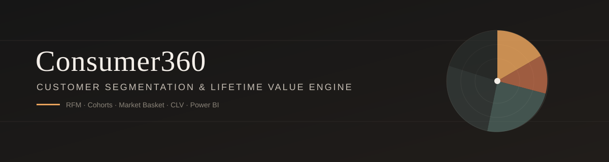

<br/>


# Consumer360

End-to-end customer analytics on 12 months of e-commerce transactions: **clean → RFM segmentation → 12-month CLV → cohort retention → market basket → Power BI**.

## Headline results

| Metric | Result |
|---|---|
| Customers analysed | **4,333** |
| Invoices / revenue (after cleaning) | **18,400** / **$8.49M** |
| Top 20% of customers → share of revenue | **73.9%** |
| Champions (19% of customers) → share of revenue | **63.4%** |
| One-time buyers | **34.7%** of customers |
| Month-1 retention (avg of 2011 cohorts) | **19.8%** (range 14.8%–23.5%) |
| Month-3 / Month-6 retention | **22.9%** / **25.0%** |
| CLV model — decile-level correlation, predicted vs actual (6-month holdout) | **0.994** |
| Basket rules found (support ≥ 1%, confidence ≥ 30%, lift ≥ 1.5) | **445** across 629 frequent products |

## Dataset

UCI *Online Retail*: transactions from a UK-based online gift-ware retailer, **1 Dec 2010 – 9 Dec 2011**. About 89% of line items are UK; many customers are wholesalers, so a few accounts are very large.

## Data quality: what was fixed and why it matters

| Issue in raw data | Handling | Impact |
|---|---|---|
| 5,192 exact duplicate rows | Dropped | Removes double-counted revenue |
| 1,542 non-product lines (`POST`, `M`, `DOT`, `BANK CHARGES`, `C2`, `PADS`) | Dropped (keep 5-digit product codes only) | −$150K; stops postage and fees from appearing in basket rules |
| 2 fully cancelled orders (#581483, #541431) whose originals survived the cancellation filter | Dropped | −$246K; one customer was previously ranked #4 by CLV from a cancelled order |
| Product descriptions with trailing spaces / variants | One canonical description per `StockCode` | Prevents the same product appearing as two items |
| **Total** | **$8.91M → $8.49M (−4.7%)** | |

## Methodology

### 1. RFM segmentation

- **Recency** and **Monetary**: quintile scores; identical values always receive the same score.
- **Frequency**: fixed bins (1 / 2 / 3–4 / 5–8 / 9+ orders), because 35% of customers bought once and quantile cuts cannot split ties fairly.
- Six non-overlapping segments, defined on R and F:

| Segment | Rule | Customers | % of revenue | Avg 12-mo CLV |
|---|---|---|---|---|
| 🏆 Champions | R ≥ 4 and F ≥ 4 | 822 (19.0%) | 63.4% | $6,506 |
| 💎 Loyal | R ≥ 3 and F ≥ 3 | 792 (18.3%) | 16.1% | $2,310 |
| 🌱 New / Promising | R ≥ 4, F ≤ 2 | 517 (11.9%) | 3.0% | $1,424 |
| 👀 Needs Attention | R = 3, F ≤ 2 | 478 (11.0%) | 2.9% | $938 |
| ⚠️ At Risk | R ≤ 2 and F ≥ 3 | 384 (8.9%) | 7.5% | $1,609 |
| 💤 Hibernating | R ≤ 2 and F ≤ 2 | 1,340 (30.9%) | 7.1% | $418 |

### 2. Customer lifetime value

- **BG/NBD** (expected purchases) × **Gamma-Gamma** (expected order value) → expected revenue over the next 365 days.
- Validated on a holdout: fit on the first ~6 months, predict the last ~6 months.

| Validation metric | Value |
|---|---|
| Customers validated | 2,784 |
| Decile-level correlation (predicted vs actual purchases) | 0.994 |
| Customer-level MAE (model / naive own-rate / global mean) | 1.49 / 1.59 / 2.24 |
| Total purchases predicted vs actual | 5,997 vs 6,802 (−11.8%) |
| Frequency–order-value correlation (Gamma-Gamma assumption) | 0.11 |

**Read this as a ranking tool, not a revenue forecast.** The model orders customers very well, but under-predicts volume by ~12% because the holdout window contains the Q4 holiday peak. One year of data also gives no evidence of customer "death" (the BG/NBD dropout parameters converge to ~0), so probability-alive is not reported.

### 3. Cohort retention

- Cohort = month of first purchase; retention = share of the cohort ordering in month *n*.
- Two artefacts are excluded from averages:
  - **Dec-2010 cohort** (884 customers, ~3× the median cohort): left-censored, since it includes existing customers rather than new ones.
  - **Dec-2011 activity**: the month is incomplete (data ends 9 Dec).

| Finding | Evidence |
|---|---|
| Churn is front-loaded | ~80% of a new cohort does not return in month 1 |
| Retention then plateaus | 22.9% at M3, 25.0% at M6, with no steady decay |
| Acquisition timing has a modest effect | M1 retention spans 14.8%–23.5% across 2011 cohorts |

### 4. Market basket analysis

- Baskets = invoices (18,400); rules evaluated in **both directions**, with support measured over all invoices.
- Filters: support ≥ 1%, confidence ≥ 30%, lift ≥ 1.5.
- Strongest rules are **colour/design variants of the same product family** (e.g. Regency tea plate pink → green: lift 61, confidence 90%). Group variants into families before using rules for cross-sell.

## Repository layout

```
Consumer-360/
├── consumer360_pipeline.py        # reproducible clean → RFM → CLV → cohort → basket
├── notebooks/                     # exploratory versions of each step
├── outputs/
│   ├── rfm_clv_output.csv         # one row per customer: R, F, M, segment, 12-mo CLV
│   ├── segment_summary.csv
│   ├── cohort_retention.csv
│   ├── market_basket_rules.csv
│   └── metrics.json               # every number quoted in this README
├── dashboards/                    # .pbix, PDF export, screenshots
├── datasets/
├── assets/
├── README.md
└── LICENSE
```

## Reproduce

```bash
pip install pandas numpy lifetimes
python consumer360_pipeline.py --db retailiq.db --out outputs/
```

## Suggested actions by segment

| Segment | Action |
|---|---|
| Champions | Protect: early access, loyalty perks; the top ~20% of customers drive ~74% of revenue |
| Loyal | Upsell toward Champions using basket-rule bundles |
| New / Promising | Second-purchase campaign inside month 1 (where most churn happens) |
| At Risk | Win-back offers, prioritised by 12-month CLV |
| Hibernating | Low-cost reactivation only; avg CLV is $418 |

## Limitations

- One year of data: no multi-season view, and no independent test of seasonality.
- Transactions only: no marketing spend, margins, or channel data, so CLV is revenue-based, not profit-based.
- RFM segment cut-offs are judgement-based, not validated against campaign response.

## Roadmap

- Supervised churn model (time-based split, precision/recall/AUC)
- Basket rules on product families rather than individual SKUs
- Profit-based CLV once margin data is available

<br/>

<p align="center"><sub>MIT licensed · Consumer360 · retail analytics portfolio project</sub></p>
