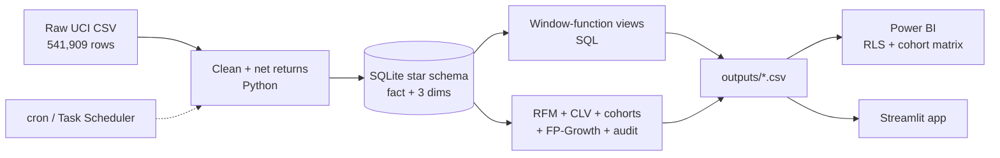
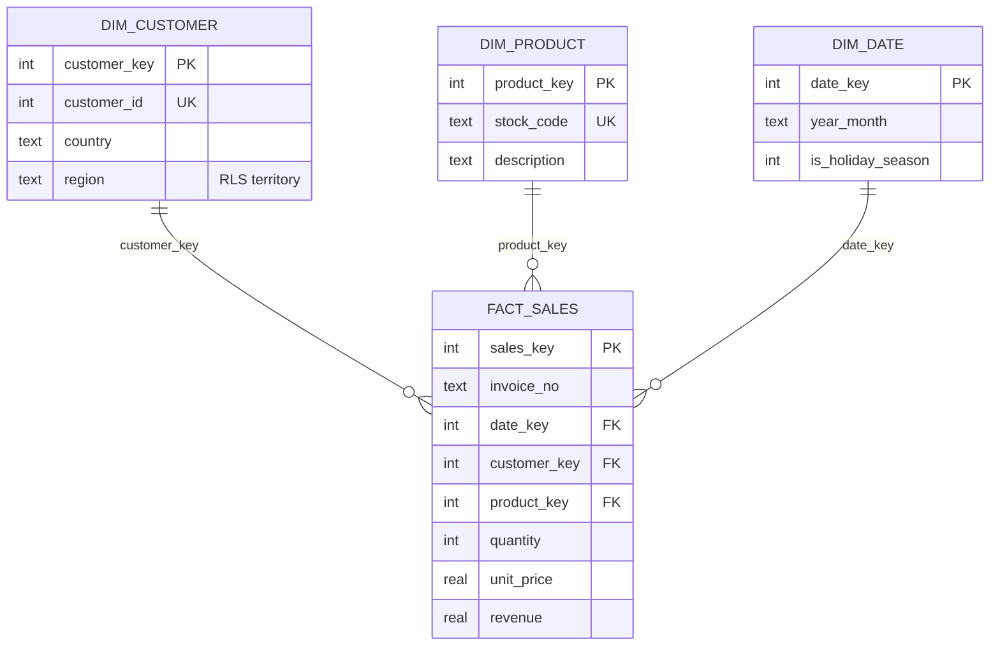

<br/>


# Consumer360

**Identify the "Whales" versus the "Churn Risks" automatically.** An end-to-end customer analytics engine on the UCI *Online Retail* dataset (541,909 raw transactions, Dec 2010 – Dec 2011):

`raw data → returns netting → SQL star schema → RFM → CLV (Lifetimes) → cohorts → market basket (FP-Growth) → statistical audit → churn-risk list → Power BI / Streamlit`

## Headline results

| Metric | Result |
|---|---|
| Customers / invoices / **net** revenue | **4,324** / **18,265** / **$8.25M** |
| Revenue concentration | Top 20% of customers → **73.6%** of revenue |
| Champions | **18.9%** of customers → **63.8%** of revenue |
| One-time buyers | **34.8%** of customers |
| Month-1 retention (2011 cohorts) | **19.7%** (range 14.4%–23.6%); plateaus at 22.8% (M3) and 25.0% (M6) |
| Segments predict the future? | Champions spent **$6,548** on average in the next 6 months vs **$434** for Hibernating (p < 0.001) |
| CLV model | Decile-level correlation **0.994** on a 6-month holdout |
| Churn-risk list | **383** customers, **$514K** of expected 12-month revenue at stake |
| Market basket | **702** rules from **1,040** frequent itemsets (FP-Growth, support ≥ 1%) |
| SQL view execution | **< 0.6 s** each (target < 2 s) |
| Full pipeline runtime | **~17 s**, 12 automated data-validation checks |

## Architecture


```mermaid
flowchart LR
    A[Raw UCI CSV<br/>541,909 rows] --> B[Clean + net returns<br/>Python]
    B --> C[(SQLite star schema<br/>fact + 3 dims)]
    C --> D[Window-function views<br/>SQL]
    C --> E[RFM + CLV + cohorts<br/>+ FP-Growth + audit]
    D --> F[outputs/*.csv]
    E --> F
    F --> G[Power BI<br/>RLS + cohort matrix]
    F --> H[Streamlit app]
    I[cron / Task Scheduler] -.-> B
```

## Data model (star schema)


```mermaid
erDiagram
    DIM_CUSTOMER ||--o{ FACT_SALES : customer_key
    DIM_PRODUCT  ||--o{ FACT_SALES : product_key
    DIM_DATE     ||--o{ FACT_SALES : date_key
    FACT_SALES {
        int sales_key PK
        text invoice_no
        int date_key FK
        int customer_key FK
        int product_key FK
        int quantity
        real unit_price
        real revenue
    }
    DIM_CUSTOMER {
        int customer_key PK
        int customer_id UK
        text country
        text region "RLS territory"
    }
    DIM_PRODUCT {
        int product_key PK
        text stock_code UK
        text description
    }
    DIM_DATE {
        int date_key PK
        text year_month
        int is_holiday_season
    }
```

Analytical views in `sql/02_views.sql` (window functions): `vw_single_customer_view` (`LAG`), `vw_monthly_revenue` (`LAG`, running `SUM OVER`), `vw_top_products_by_country` (`RANK OVER PARTITION`), `vw_customer_activity` (`MIN OVER PARTITION`), `vw_revenue_pareto` (cumulative `SUM OVER`).

## Data quality: from $8.91M gross to $8.25M net

| Step | Rows / lines | Revenue effect |
|---|---|---|
| Sales lines with a customer, qty > 0, price > 0 | 397,884 | **$8,911,408** gross |
| Exact duplicate lines removed | 5,194 | −$24.8K |
| **Returns netted against their original purchase** | 8,905 return lines ($611K) | −$504.1K matched |
| Non-product lines removed (`POST`, `M`, `DOT`, `BANK CHARGES`, …) | 1,516 | −$136.2K |
| **Net revenue analysed** | **388,336** | **$8,246,294** |

**Returns handling** (the raw file has 8,905 cancellation lines the original ETL simply discarded):

| Return type | Value | Treatment |
|---|---|---|
| Product returns matched to the customer's earlier purchase (most recent first) | $450.0K | Quantity reduced on the original line |
| Manual adjustments (`StockCode = M`) matched by exact value to an earlier order line | $54.1K | Original line removed (e.g. the 60 × $649.50 basket order) |
| Product returns with no earlier purchase in the window | $24.0K | Reported, not guessed |
| Manual adjustments with no matching order | $58.1K | Reported, not guessed |
| Non-product credits (postage, discounts) | $24.8K | Ignored |

Impact: without netting, a single cancelled $38,970 order made one customer the #1 churn-risk priority, and cancelled orders of 74,215 and 80,995 units inflated revenue by $246K.

## Methodology

### 1. RFM segmentation
- **Recency** and **Monetary**: quintile scores, with identical values always receiving the same score.
- **Frequency**: fixed bins (1 / 2 / 3–4 / 5–8 / 9+ orders), because 35% of customers bought once and quantiles cannot split ties fairly.
- Six non-overlapping segments defined on R and F:

| Segment | Rule | Customers | % of revenue | Avg 12-mo CLV |
|---|---|---|---|---|
| 🏆 Champions | R ≥ 4 and F ≥ 4 | 816 (18.9%) | 63.8% | $6,400 |
| 💎 Loyalists | R ≥ 3 and F ≥ 3 | 790 (18.3%) | 16.1% | $2,258 |
| 🌱 New / Promising | R ≥ 4, F ≤ 2 | 519 (12.0%) | 3.0% | $1,400 |
| 👀 Needs Attention | R = 3, F ≤ 2 | 475 (11.0%) | 2.9% | $925 |
| ⚠️ At Risk | R ≤ 2 and F ≥ 3 | 383 (8.9%) | 6.5% | $1,343 |
| 💤 Hibernating | R ≤ 2 and F ≤ 2 | 1,341 (31.0%) | 7.6% | $433 |

### 2. Statistical audit: do segments mean anything?
Customers were re-segmented using **only data up to 6 months before the end**, then their *actual* later spend was measured.

| Segment | Customers | Mean spend, next 6 months | Repurchase rate |
|---|---|---|---|
| Champions | 333 | **$6,548** | **97%** |
| Loyalists | 442 | $1,405 | 89% |
| At Risk | 96 | $937 | 76% |
| New / Promising | 519 | $631 | 71% |
| Needs Attention | 406 | $538 | 62% |
| Hibernating | 997 | $434 | 53% |

- Kruskal-Wallis across segments: **p < 0.001**. Champions beat every other segment (one-sided Mann-Whitney, all **p < 0.001**).
- The in-sample check the brief asks for also passes (Champions have the highest mean spend and CLV), but it is partly circular because frequency drives both, so the out-of-sample table above is the real test.

### 3. Customer lifetime value
- **BG/NBD** (expected purchases) × **Gamma-Gamma** (expected order value) via the `lifetimes` library → expected revenue over the next 365 days.
- Validated on a holdout: fit on the first ~6 months, predict the last ~6.

| Validation metric | Value |
|---|---|
| Customers validated | 2,780 |
| Decile-level correlation, predicted vs actual purchases | **0.994** |
| Customer-level MAE (model / naive own-rate / global mean) | **1.48** / 1.56 / 2.23 |
| Total purchases predicted vs actual | 5,940 vs 6,769 (−12.2%) |
| Frequency–order-value correlation (Gamma-Gamma assumption) | 0.13 (acceptable) |

**How to use it:** CLV is a strong *ranking* tool, not a revenue forecast. It under-predicts volume by ~12% (the holdout window contains the Q4 peak), and by more for Champions (−31%) and Hibernating (−40%). One year of data shows no evidence of customers "dying" (BG/NBD dropout parameters converge to ~0), so **CLV does not penalise inactivity and is not a churn probability**; pair it with recency (see the churn list).

### 4. Cohort retention
- Cohort = month of first purchase. Two artefacts are excluded: the **Dec-2010 cohort** (882 customers, ~3× the median cohort; it includes pre-existing customers) and **Dec-2011** (incomplete month).
- Churn is **front-loaded**: ~80% of a new cohort does not return in month 1, then retention plateaus.

**Do holiday-season joiners stay longer and spend more than mid-year joiners?**

| Measure | Holiday (Oct–Nov 2011) | Mid-year (May–Aug 2011) | Significance |
|---|---|---|---|
| New customers | 678 | 881 | n/a |
| Median first-order value | $282 | $280 | p = 0.37 (no difference) |
| Repurchase within 30 days | 24.3% (n = 452) | 17.3% (n = 881) | p = 0.003 |

Holiday joiners repurchase sooner, but that is also the period when *every* customer buys more, so it is not evidence they "stay longer". **The long-term question cannot be answered with one year of data**; it needs 2+ years of history.

### 5. Market basket analysis
- `mlxtend` **FP-Growth** on 18,265 invoices; rules kept at support ≥ 1%, confidence ≥ 30%, lift ≥ 1.5; itemsets up to 3 products.
- Strongest rules are **product-family variants** (Regency tea-plate colours, Poppy's Playhouse rooms; lift > 50). Group SKUs into families before using these for cross-sell.

### 6. Churn-risk list (`outputs/churn_risk_customers.csv`)
The **At Risk** segment ranked by expected 12-month value, with a recommended action tier:

| Tier | Customers | Action |
|---|---|---|
| Priority 1–50 | 50 | Personal outreach + offer (**$191K**, 37% of the value at stake) |
| Priority 51–200 | 150 | Targeted win-back email |
| Priority 201+ | 183 | Automated win-back campaign |

`days_overdue_ratio` = days since last order ÷ the customer's typical gap between orders (a ratio of 5 means five missed cycles).

## Repository layout

```
Consumer360/
├── consumer360_pipeline.py     # full pipeline; exits non-zero on any failure
├── app.py                      # Streamlit dashboard
├── sql/
│   ├── 01_star_schema.sql      # dims + fact + indexes
│   └── 02_views.sql            # window-function views
├── tests/test_consumer360.py   # 19 tests
├── schedule/                   # cron script + Windows Task Scheduler script
├── docs/powerbi_guide.md       # model, DAX, RLS, cohort matrix, Key Influencers
├── outputs/                    # generated CSVs + metrics.json (every number above)
├── dashboards/                 # .pbix + screenshots
├── notebooks/                  # original exploratory notebooks
├── data/                       # put the raw UCI CSV here (not committed)
└── requirements.txt
```

## Quickstart

```bash
pip install -r requirements.txt
python consumer360_pipeline.py --raw-csv "data/Online Retail Dataset - UCI.csv" --out outputs
streamlit run app.py
C360_RAW_CSV="data/Online Retail Dataset - UCI.csv" pytest tests -q
```

Without the raw file, `--source retailiq.db` still runs, but returns can only be removed for the three largest known cancellations, so figures will differ slightly. Use the raw file for reported numbers.

## Automation

| Platform | How |
|---|---|
| Linux / macOS | `crontab -e` → `0 2 * * 1 /path/to/Consumer360/schedule/run_pipeline.sh` |
| Windows | `schtasks /Create /SC WEEKLY /D MON /ST 02:00 /TN "Consumer360 Pipeline" /TR "C:\path\Consumer360\schedule\run_pipeline.bat"` |

Each run writes a dated log under `logs/`, returns exit code 1 on any failure or failed validation, and refreshes `outputs/` for Power BI.

## Limitations

- **One year of data**: no multi-season view; holiday retention beyond 30 days is untestable.
- **Unmatched returns** ($82K) are reported, not guessed.
- **Revenue-based CLV**: no margin, marketing spend or channel data, so it is not profit-based.
- **Segment cut-offs** are judgement-based (validated out-of-sample, but not against campaign response).
- **Region mapping** (UK / Europe ex-UK / Rest of World) is an assumption for RLS; the UK is 82% of revenue.

## Roadmap
- Supervised churn model (time-based split; precision / recall / AUC)
- Basket rules on product families rather than individual SKUs
- Profit-based CLV once margin data exists
- Multi-year data to answer the holiday-cohort question

<br/>

<p align="center"><sub>MIT licensed · Consumer360 · retail analytics portfolio project</sub></p>
